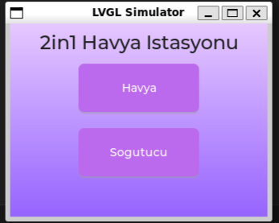
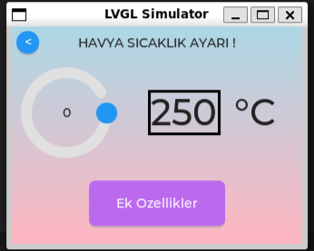
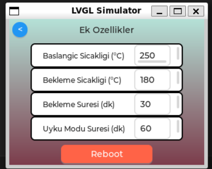
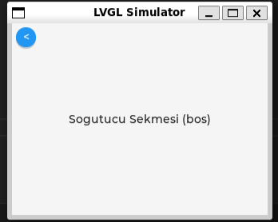
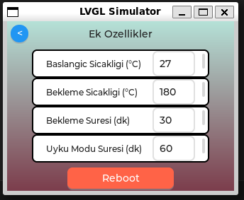
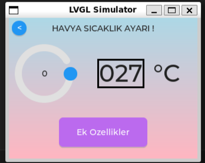
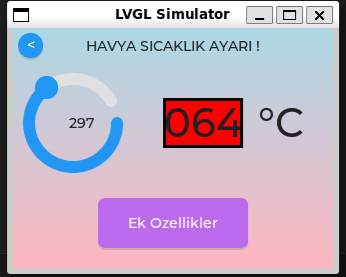
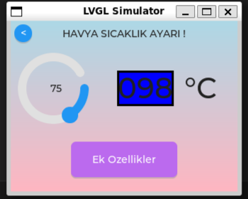
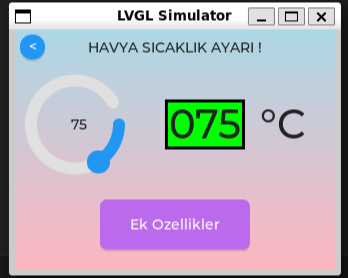
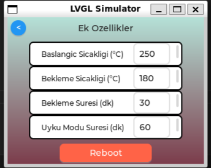

# LVGL Soldering Station UI Simulation

This project is an **embedded-style graphical user interface simulation** of a **2-in-1 soldering station**, developed using **LVGL** and the **SDL simulator**.

It demonstrates how a real embedded device can provide **interactive control, real-time feedback, and parameter management** through a modern UI.

---

## 🚀 Features

- Arc-based temperature control (knob-like interaction)
- Smooth animated temperature transitions
- Real-time temperature visualization
- Dynamic color feedback:
  - 🔴 Heating (temperature increasing)
  - 🔵 Cooling (temperature decreasing)
  - 🟢 Target reached
- Editable system parameters:
  - Start temperature
  - Standby temperature
  - Standby time
  - Sleep mode time
- Input validation (only valid numeric ranges allowed)
- Reboot/reset functionality
- Multi-screen UI navigation

---

## 🧠 System Behavior

The system simulates a **real soldering station control interface**:

- The user sets a **target temperature** using an arc component
- The system gradually updates the current temperature using a **timer-based animation**
- The current value is displayed in a **digital box**
- The background color of the box changes dynamically:
  - Red → temperature rising
  - Blue → temperature falling
  - Green → target reached

This allows the user to clearly observe:
- where the temperature starts
- where it is going
- how it changes over time

---

## 🖥️ Screens Overview

### 1. Main Menu
- Havya (Soldering Iron)
- Soğutucu (Cooling Unit)

### 2. Havya Screen
- Arc-based temperature adjustment
- Digital temperature display
- Real-time animated feedback

### 3. Extra Settings Screen
- Editable parameters using text input fields
- Keyboard interaction
- Value validation
- Reset (reboot) button

### 4. Cooling Screen
- Placeholder for future functionality

---

## 📸 Simulation Outputs

### 🔹 Main Screens

  
  
  
  

---

### 🔹 Parameter Changes

  
  

---

### 🔹 Temperature Transitions

  
  
  

---

### 🔹 System Reset

 

---

## ⚙️ Technologies Used

- C Programming Language
- LVGL (Light and Versatile Graphics Library)
- SDL (Simulation Layer)
- WSL (Windows Subsystem for Linux)
- Visual Studio Code

---

## 🛠️ Development Environment

This project was developed using:

- **VS Code** as the main editor
- **WSL terminal** for building and running the project
- LVGL + SDL for UI simulation

---

## ▶️ How to Run

Make sure you have **LVGL and SDL properly installed** on your system before running the project.

Then use the following commands:

cd /mnt/c/Users/LENOVO/lv_sim_eclipse_sdl/build

make -j8

../bin/main

>⚠️ Note:
  The path (/mnt/c/Users/LENOVO/...) may differ depending on your system.
  You should update the path according to where your project is located.

---

🎯 Purpose

This project aims to demonstrate:

- Embedded UI design principles
- Event-driven programming
- Real-time system feedback
- User interaction handling
- Parameter validation and control

---

🧩 Future Improvements

- Simulate real sensor data
- Implement cooling system behavior
- Improve UI design and animations
